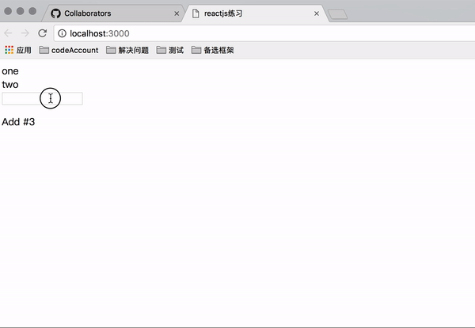

# my_reactjs
自己实现的reactjs，用于加深对React的理解

## Quick Start

```shell
 git clone git@github.com:lingximu/my_reactjs.git
 cd my_reactjs
 npm install
 npm start ## 内部用browser-sync代理index.hmtl进行开发
```

## Introduce

> 包括两个方面初次渲染和组件更新两部分

### 初次渲染
三个基本组件类

```js
ReactDOMTextComponent
ReactDOMComponent
ReactCompositeComponent
```

> - 所有都用`React.createElement`进行初始化，包括`React.createClass`生成的组件。
> - 用`instantiateReactComponent`实例化
> - 用`mountComponent`挂载(每个类只关心自己的)

### 组件更新
用`setState`及各个类上的`receiveComponent` 更新.
其中包括三个关键方法 `_shouldUpdateReactComponent` 、`_diff` 、 `_patch`。

> - `_shouldUpdateReactComponent`用来判断是否是相同的组件，从而判断是修改还是重新`mount`.
> - `_diff`核心算法，判断改变的节点。所有的并存在` diffQueue` 中。
> - `_patch`，在用 `_diff` 收集完所有改变后，用这个方法进行改变。


## 效果如下
> 实现了初次渲染、数据更新、组件更新的功能

